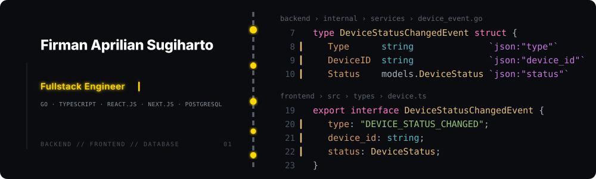
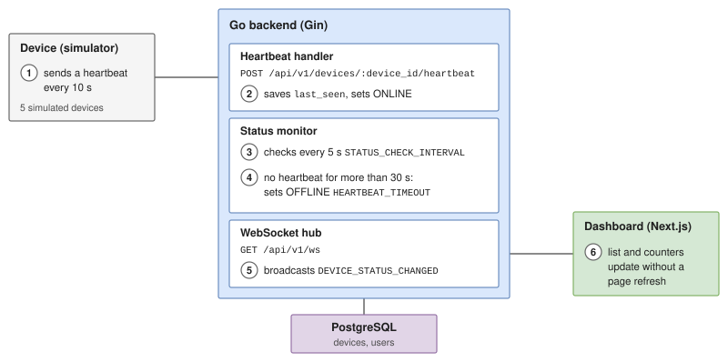
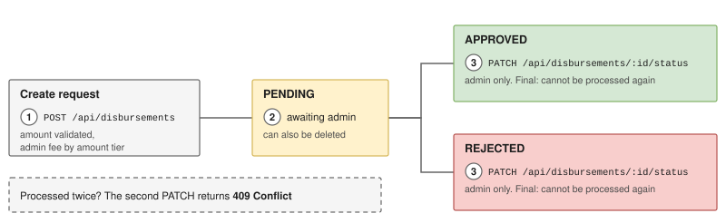
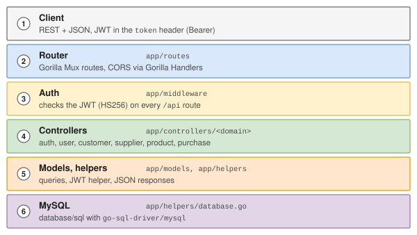
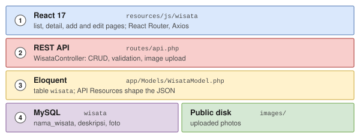

<div align="justify">

<p align="center">
  
</p>

### <h3>`{ about_me }`</h3>

Fullstack Engineer building secure, scalable and maintainable applications. I have spent 3+ years building and maintaining web applications for clients and internal teams, including **CRM** and **POS** systems in **PHP** and **MySQL**.

On my own projects I write backends in **Go** and frontends in **React** and **Next.js**, aiming for the same three things in every one:

- **Secure:** JWT authentication, bcrypt password hashing, role-based access control and validated file uploads.
- **Scalable:** paginated, searchable and filterable list endpoints, and realtime updates pushed over WebSocket rather than page reloads.
- **Maintainable:** a layered code structure, a unit-tested JWT helper, and `go test` and `go vet` running in GitHub Actions.

### <h3>`{ stack }`</h3>

<table>
  <tr>
    <td><b>Backend</b></td>
    <td>
      
      
      
      
      
      
      
      
      
      
    </td>
  </tr>
  <tr>
    <td><b>APIs &amp; realtime</b></td>
    <td>
      
      
      
      
    </td>
  </tr>
  <tr>
    <td><b>Databases</b></td>
    <td>
      
      
    </td>
  </tr>
  <tr>
    <td><b>Frontend</b></td>
    <td>
      
      
      
    </td>
  </tr>
  <tr>
    <td><b>Tooling</b></td>
    <td>
      
      
      
      
    </td>
  </tr>
</table>

### <h3>`{ projects }`</h3>

<table>
<tr>
<td width="50%" valign="top">

#### Device Monitoring System

Realtime device availability monitoring with a Go backend and a Next.js dashboard. A device is marked `OFFLINE` after 30 seconds without a heartbeat.

<p align="left">
  
  
  
  
  
  
  
</p>

<p align="left">
  <a href="https://github.com/shiinobu/device-monitoring-system"></a>
  <a href="https://firman-aprilian.vercel.app/projects/device-monitoring-system"></a>
</p>

</td>
<td width="50%" valign="top">

#### Disbursement API

REST API for fund disbursement requests, built around business rules rather than plain CRUD. Processed requests are final: a second attempt returns `409 Conflict`.

<p align="left">
  
  
  
  
  
  
</p>

<p align="left">
  <a href="https://github.com/shiinobu/disbursement-api"></a>
  <a href="https://firman-aprilian.vercel.app/projects/disbursement-api"></a>
</p>

</td>
</tr>
<tr>
<td width="50%" valign="top">

#### Manufacture System API

REST API for users, customers, suppliers, products and purchase transactions, behind JWT (HS256) authentication middleware.

<p align="left">
  
  
  
  
  
</p>

<p align="left">
  <a href="https://github.com/shiinobu/manufacture-system-api"></a>
</p>

</td>
<td width="50%" valign="top">

#### Tourism Management API

Laravel 8 REST API with a React 17 frontend for managing tourism destinations, with validated image uploads.

<p align="left">
  
  
  
  
</p>

<p align="left">
  <a href="https://github.com/shiinobu/tourism-management-api"></a>
</p>

</td>
</tr>
<tr>
<td colspan="2">

<details>
<summary>Device Monitoring System: details and flow</summary>

- Devices send a heartbeat every 10 seconds. A background monitor checks every 5 seconds, marks a device `OFFLINE` after 30 seconds without one, and pushes the change to the dashboard over WebSocket.
- JWT admin login, device CRUD, notifications, CSV export, a five-device simulator, and the whole stack in Docker Compose.



</details>

<details>
<summary>Disbursement API: details and lifecycle</summary>

- JWT authentication with bcrypt password hashing and `admin` / `operator` roles.
- Amount validation, an admin fee by amount tier, pagination, search, status filtering and CSV export.



| Status | Set by | Next |
|---|---|---|
| `PENDING` | Any signed-in user, on create | Can be approved, rejected or deleted |
| `APPROVED` | Admin only | Final: processing it again returns `409 Conflict` |
| `REJECTED` | Admin only | Final: processing it again returns `409 Conflict` |

</details>

<details>
<summary>Manufacture System API: details, request path and structure</summary>

- JWT (HS256) authentication middleware in front of the protected routes, built on Gorilla Mux and MySQL.
- The JWT helper is unit tested (valid, expired, wrong secret, wrong signing method), and CI runs `go test` and `go vet` through GitHub Actions.



```text
app/
├── app.go                 server setup and CORS
├── routes/routes.go       Gorilla Mux routes
├── middleware/            JWT auth middleware
├── controllers/           auth, customer, product, purchase, supplier, user
├── models/                one package per domain
├── helpers/               database, jwt (with tests), logging, response
└── config/
```

</details>

<details>
<summary>Tourism Management API: details, layers and structure</summary>

- CRUD with image upload and replacement, validated for type and size, with server-generated filenames.
- Consistent JSON responses through Laravel API Resources.



```text
app/Http/Controllers/WisataController.php   CRUD, validation, image upload
app/Http/Resources/WisataResource.php       JSON shape
app/Models/WisataModel.php                  Eloquent model (table wisata)
routes/api.php                              /api/wisatas routes
resources/js/wisata/                        React app (pages in frontend/)
database/migrations/                        create_wisata_table
```

</details>

</td>
</tr>
</table>

### <h3>`{ connect }`</h3>

<p align="center">
  <a href="https://firman-aprilian.vercel.app"></a>
  <a href="https://www.linkedin.com/in/firman-aprilian-sugiharto/"></a>
  <a href="mailto:firman.apriliann@gmail.com"></a>
  <a href="https://wa.me/6285117000255"></a>
</p>

</div>

---

<p align="center">
  <sub>Firman Aprilian Sugiharto | Fullstack | Backend | Frontend</sub>
</p>